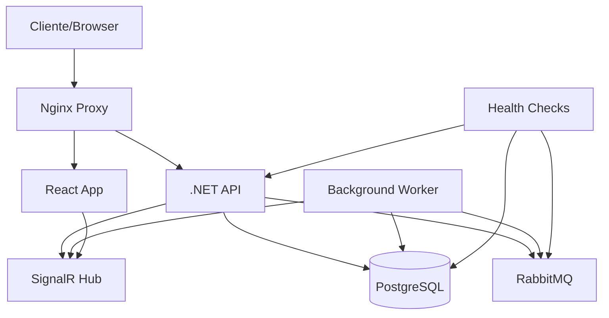

# 🚀 Sistema de Gestão de Pedidos - Desafio Técnico TMB

Sistema completo de gestão de pedidos com processamento assíncrono, desenvolvido com .NET, React e mensageria em tempo real.

## 📖 Sobre o Projeto

Este sistema permite criar, listar e visualizar pedidos com processamento assíncrono. Quando um pedido é criado, uma mensagem é enviada para o Azure Service Bus, onde um worker processa e atualiza o status do pedido em tempo real.

### Fluxo do Sistema

1. **Criação**: Cliente cria pedido via interface web
2. **Persistência**: Dados salvos no PostgreSQL
3. **Mensageria**: Mensagem enviada para a fila
4. **Processamento**: Worker consome mensagem e processa pedido
5. **Atualizações**: Status atualizado em tempo real via SignalR

## 🛠️ Tecnologias Utilizadas


### Backend
- **C# .NET 9** - Framework principal
- **Entity Framework Core** - ORM
- **PostgreSQL 17** - Banco de dados
- **RabbitMQ** - Mensageria
- **SignalR** - Comunicação em tempo real
- **Health Checks** - Monitoramento

### Frontend
- **React 18** - Interface do usuário
- **TypeScript** - Tipagem estática
- **TailwindCSS** - Estilização
- **SignalR Client** - Tempo real no frontend

### Infraestrutura
- **Docker & Docker Compose** - Containerização
- **Nginx** - Proxy reverso
- **Health Checks UI** - Dashboard de saúde

## 🏗️ Arquitetura



### Fluxo de Processamento de Pedidos

1. **Requisição HTTP** → Cliente faz requisição para criar pedido
2. **Persistência** → API salva pedido no PostgreSQL com status "Pendente"
3. **Mensagem** → Evento publicado na fila com CorrelationId=OrderId
4. **Consumo** → Worker consome mensagem de forma idempotente
5. **Processamento** → Status atualizado: Pendente → Processando → Finalizado
6. **Notificação** → SignalR notifica frontend em tempo real

## 📋 Pré-requisitos

- [Docker](https://www.docker.com/) e Docker Compose
- [Git](https://git-scm.com/)
- [Make](https://www.gnu.org/software/make/) (opcional, mas recomendado)

## 🚀 Instalação e Execução

### 1. Clonar o Repositório

```bash
git clone <url-do-repositorio>
cd desafio-tmb
```

### 2. Inicializar Submódulos

```bash
git submodule update --init --recursive
```

### 3. Configurar Ambiente

```bash
# Copiar arquivo de exemplo
cp .env.example .env

# Editar variáveis de ambiente (ver seção Configuração)
nano .env
```

### 4. Executar Migrações

```bash
# Adicionar migração inicial
make migration/add IniciarProjeto

# Aplicar migrações
make migration/update
```

### 5. Iniciar Aplicação

```bash
# Construir e iniciar todos os serviços
docker compose up --build

# Ou executar em background
docker compose up --build -d
```

### 6. Verificar Saúde dos Serviços

Acesse: http://localhost:8081/healthchecks-ui#/healthchecks (Health Checks Dashboard)

## ⚙️ Configuração

### Variáveis de Ambiente (.env)

```bash
# Banco de Dados PostgreSQL
POSTGRES_HOST=postgres
POSTGRES_PORT=5432
POSTGRES_USER=tmb_user
POSTGRES_PASSWORD=tmb_password
POSTGRES_DB=tmb_orders

# API .NET
ASPNETCORE_ENVIRONMENT=Development
API_HOST=0.0.0.0
API_PORT=8080

# Mensageria (RabbitMQ como alternativa ao Azure Service Bus)
RABBITMQ_HOST=rabbitmq
RABBITMQ_USER=guest
RABBITMQ_PASS=guest

# Health Checks
HEALTHCHECKS_UI_PORT=8081

# Frontend React
REACT_APP_SIGNALR_HUB_URL=http://localhost:8080/orderhub
REACT_APP_HEALTH_URL=http://localhost:8081
REACT_APP_TBM_API_URL=http://localhost:8080/api
REACT_PORT=3000
```

## 🌐 Endpoints da API

### Pedidos (Orders)

| Método | Endpoint | Descrição |
|--------|----------|-----------|
| `POST` | `/api/orders` | Criar novo pedido |
| `GET` | `/api/orders` | Listar todos os pedidos |
| `GET` | `/api/orders/{id}` | Obter detalhes de um pedido |


## ✨ Funcionalidades

### Core Features
- ✅ Criação, listagem e visualização de pedidos
- ✅ Processamento assíncrono com mensageria
- ✅ Atualizações em tempo real via SignalR
- ✅ Health checks para todos os componentes
- ✅ Interface responsiva com TailwindCSS

### Status do Pedido
- **Pendente** → Estado inicial após criação
- **Processando** → Worker iniciou processamento
- **Finalizado** → Pedido processado com sucesso

### Recursos Técnicos
- **Idempotência** → Mensagens processadas apenas uma vez
- **Correlation ID** → Rastreamento de pedidos
- **Health Monitoring** → Monitoramento contínuo
- **Docker Compose** → Ambiente completo containerizado


## 🌍 URLs de Acesso

| Serviço | URL | Descrição |
|---------|-----|-----------|
| **Frontend** | http://localhost:3000 | Interface do usuário |
| **API** | http://localhost:8080 | Backend .NET |
| **Health Checks** | http://localhost:8081 | Dashboard de saúde |


## 📝 Notas de Desenvolvimento

- O worker processa mensagens com delay de 5 segundos para simular processamento real
- SignalR fornece feedback visual imediato das mudanças de status
- Todas as operações de mensageria são idempotentes
- Health checks são executados a cada 30 segundos
- A troca de `Azure bus service` para `RabbitMQ` consiste na necessidade de testes locais de forma mais consistente e sem geramento de faturas dentro da cloud da AZURE

---